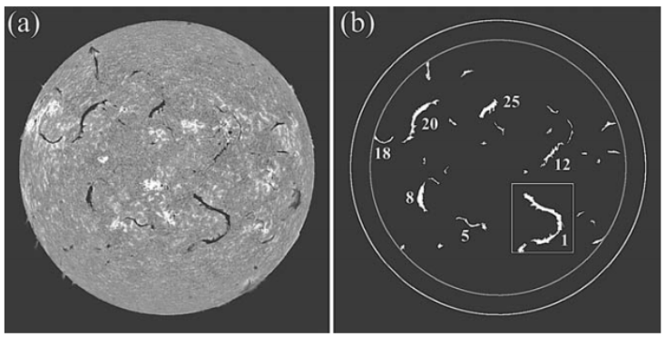
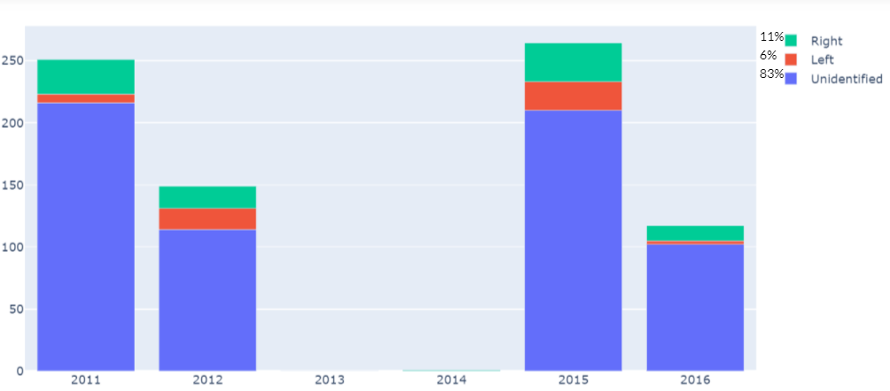

# Torch Compatible Augmentation Engine For Solar Filaments v0.0.1

### An ML-Ready Filament Augmentation Toolkit with Labeled Magnetic Helicity Sign

##### *ABSTRACT*
A halo Coronal Mass Ejection can have a devastating impact on Earth by causing damage to satellites and electrical transmission line facilities and disrupting radio transmissions. To predict the orientation of the magnetic field (and therefore the occurrence of a geomagnetic storm) associated with an occurring CME, filaments' sign of magnetic helicity can be used. This would allow us to predict a geomagnetic storm.

With the deluge of image data produced by ground-based and space-borne observatories and the unprecedented success of computer vision algorithms in detecting and classifying objects (events) on images, identification of filaments' chirality appears to be a well-fitted problem in this domain. To be more specific, Deep Learning algorithms with a Convolutional Neural Network (CNN) backbone are made to attack this very type of problem. The only challenge is that these supervised algorithms are data-hungry; their large number of model parameters demand millions of labeled instances to learn. Datasets of filaments with manually identified chirality, however, are costly to be built. This scarcity exists primarily because of the tedious task of data annotation, especially that identification of filaments' chirality requires domain expertise. In response, we created a pipeline for the augmentation of filaments based on the existing and labeled instances. This Python toolkit provides a resource of unlimited augmented (new) filaments with labeled magnetic helicity signs. Using an existing dataset of H-alpha based manually-labeled filaments as input seeds, collected from August 2000 to 2016 from the big bear solar observatory (BBSO) full-disk solar images, we augment new filament instances by passing labeled filaments through a pipeline of chirality-preserving transformation functions. This augmentation engine is fully compatible with PyTorch, a popular library for deep learning and generates the data based on users requirement.

*Reference :  Bernasconi, Pietro N., David M. Rust, and Daniel Hakim. "Advanced automated solar filament detection and characterization code: description, performance, and results." Solar Physics 228, no. 1 (2005): 97-117.*
### DATA IMBALANCE

